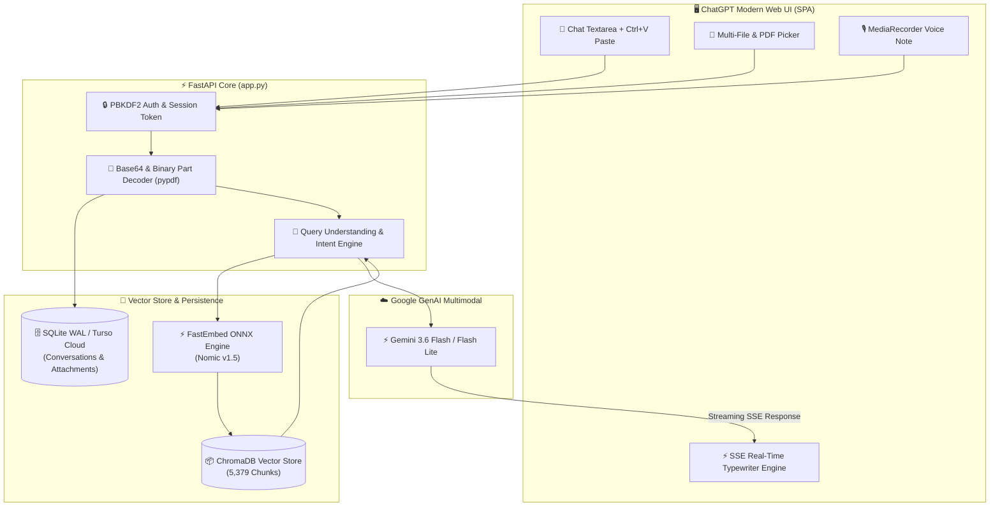

<div align="center">

# ⚡ GoHighLevel (GHL) RAG Assistant & Multimodal AI Platform
### 🚀 Enterprise ChatGPT-Grade AI • Vector Search (5,379 Chunks) • Vision & Voice Notes • Gemini 3.6 Flash

<p align="center">
  <a href="#-key-features"></a>
  <a href="#-tech-stack"></a>
  <a href="#-tech-stack"></a>
  <a href="#-tech-stack"></a>
  <a href="#-tech-stack"></a>
  <a href="#-tech-stack"></a>
</p>

<p align="center">
  <b>A state-of-the-art GoHighLevel Technical AI Consultant with 1:1 ChatGPT Dark UI, multimodal file attachments, real-time voice recording, screenshot vision analysis, and sub-second hybrid semantic search.</b>
</p>

---

[🌟 Features](#-key-features) • [🏗️ Architecture](#️-system-architecture) • [🚀 Quickstart](#-quickstart-guide) • [📂 Project Structure](#-project-structure) • [🔌 API Reference](#-api-reference) • [🛡️ Security](#-security--authentication)

---

</div>

## 🌟 Key Features

### 🎨 1:1 ChatGPT User Interface (Pixel-Perfect)
* **Glassmorphism Dark Cockpit**: Tokyo-Night dark theme with smooth gradient accents and backdrop filters.
* **ChatGPT Bubble Alignment**: Native right-aligned user bubble layout and left-aligned assistant responses.
* **Sidebar History Management**: Grouped date conversations (*Today*, *Yesterday*, *Previous 7 Days*, *Older*) with real-time title synthesis, pin toggling, rename, and soft/permanent deletion.
* **Instant Typewriter SSE Stream**: Sub-millisecond word-by-word streaming animation with automatic scroll alignment.

### 🧠 Multimodal Vision & Document Intelligence
* **📎 Document Ingestion**: Upload PDFs, CSVs, JSON, TXT, Markdown, and code scripts. Built-in `pypdf` extraction enriches prompts with full document context.
* **🖼️ Screenshot Vision (`Ctrl + V`)**: Direct clipboard screenshot pasting and image drag-and-drop with HD Lightbox modal preview.
* **🎙️ Live Voice Recording**: HTML5 `MediaRecorder` audio notes with pulsating waveforms, live timer, and in-chat audio player.
* **⚡ Gemini 3.6 Flash Multimodal Pipeline**: Seamlessly feeds text prompt + binary parts (`types.Part.from_bytes()`) directly to Gemini with auto-fallback.

### ⚡ Hybrid RAG Engine (5,379 Chunks)
* **ChromaDB Vector Store**: Semantic indexing of the entire official GoHighLevel knowledge base.
* **FastEmbed ONNX Embeddings**: Sub-second query vectorization powered by `nomic-ai/nomic-embed-text-v1.5`.
* **Hybrid Search + Intent Reranking**: Reciprocal Rank Fusion (RRF) combining dense vector search and BM25 entity matching.
* **Truthful Solutions Architecture**: Provides deep architectural breakdowns (Triggers, Actions, Custom Values, Webhooks, APIs) without generic refusal errors.

---

## 🏗️ System Architecture



---

## 🚀 Quickstart Guide

### 1. Clone the Repository
```bash
git clone https://github.com/muhammadokashapak/XortLogix.git
cd "XortLogix/GHL RAG"
```

### 2. Configure Environment Variables
Create a `.env` file in the project root:
```env
# Gemini API Key
GEMINI_API_KEY=your_gemini_api_key_here

# Turso Cloud Database (Optional - falls back to local SQLite automatically)
TURSO_DATABASE_URL=
TURSO_AUTH_TOKEN=

# Server Port
PORT=7860
HOST=127.0.0.1
```

### 3. Install Python Dependencies
```bash
pip install -r requirements.txt
```

### 4. Launch Application Server
```bash
python app.py
```
> 🚀 Application will start at **`http://127.0.0.1:7860`**

### 5. Default Credentials
* **Email:** `sara@example.com`
* **Password:** `Password123`
* **Master Admin:** `muhammad.okasha2146@gmail.com`

---

## 📂 Project Structure

```text
GHL RAG/
├── app.py                  # FastAPI Application Server & Streaming SSE Endpoint
├── db.py                   # SQLite (WAL Mode) / Turso Database & Auth Engine
├── rag_engine.py           # Hybrid RAG, Intent Decider & Prompt Builder
├── rag_microservice.py     # Standalone Microservice for External Integrations
├── test_rag_pipeline.py    # Automated Test Suite for RAG Pipeline
├── requirements.txt        # Python Dependencies
├── .env.example            # Environment Configuration Template
├── ghl_chroma_db/          # Persistent ChromaDB Vector Index (5,379 Chunks)
├── static/                 # Frontend SPA Assets (1:1 ChatGPT)
│   ├── index.html          # Clean HTML5 SPA Interface
│   ├── style.css           # Modern Dark Glassmorphism Design System
│   └── app.js              # Multimodal Client Engine & SSE Streamer
└── laravel_app/            # PHP Laravel 11.x Backend Alternative Architecture
```

---

## 🔌 API Reference

### 🔐 Authentication

#### `POST /api/auth/login`
```json
// Request
{
  "email": "sara@example.com",
  "password": "Password123"
}

// Response (200 OK)
{
  "token": "sess_89f71c...",
  "user": {
    "id": "user_01a...",
    "name": "Sara Khan",
    "email": "sara@example.com"
  }
}
```

### 💬 Multimodal Streaming Chat

#### `POST /api/chat`
*Headers: `Authorization: Bearer <session_token>`*
```json
// Request
{
  "query": "How do I trigger an SMS when a Zoom meeting is booked in GHL?",
  "conversation_id": "conv_3a91...",
  "top_k": 4,
  "attachments": [
    {
      "name": "workflow_screenshot.png",
      "type": "image",
      "mime_type": "image/png",
      "data": "data:image/png;base64,iVBORw0KGgo...",
      "size": 45210
    }
  ]
}

// Response: text/event-stream (SSE)
data: {"type": "meta", "conversation_id": "conv_3a91...", "conversation_title": "Zoom SMS Workflow"}
data: {"type": "chunk", "text": "### 🟢 Native GoHighLevel Feature\n\nTo automate..."}
data: {"type": "done", "model": "gemini-3.6-flash", "elapsed_ms": 420.5}
```

---

## 🛡️ Security & Authentication

* 🔑 **Zero-Knowledge Encryption**: Passwords hashed using `PBKDF2_HMAC_SHA256` with 100,000 rounds and unique cryptographically secure 32-byte salts.
* 🛡️ **Session Tokens**: Cryptographic session tokens (`secrets.token_hex(32)`) with automatic expiration tracking.
* 📦 **Atomic Persistence**: SQLite configured in Write-Ahead-Logging mode (`PRAGMA journal_mode=WAL;`) preventing lock contention and ensuring crash-safe data integrity.
* 🔒 **Air-Gapped Embedding**: Vectorization performed 100% locally via FastEmbed ONNX Runtime without sending raw user docs to external embedding APIs.

---

<div align="center">

### ⚡ Powered by **XORTLOGIX Engineering**
*Next-Generation Artificial Intelligence & CRM Solutions.*

<sub>© 2026 XortLogix. All rights reserved.</sub>

</div>