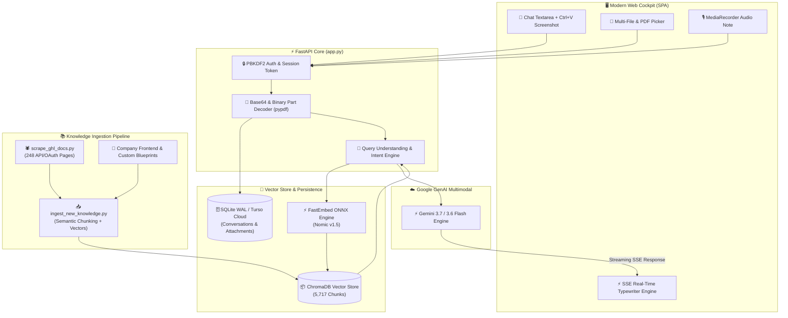

<div align="center">

# ⚡ GoHighLevel (GHL) Enterprise RAG Assistant & Multimodal AI Platform
### 🚀 Enterprise ChatGPT-Grade AI • Vector Store (5,717 Chunks) • REST API v2 & OAuth 2.0 • Custom Front-End Deliverables • Gemini 3.6/3.7 Flash

<p align="center">
  <a href="#-key-features"></a>
  <a href="#-tech-stack"></a>
  <a href="#-tech-stack"></a>
  <a href="#-tech-stack"></a>
  <a href="#-tech-stack"></a>
  <a href="#-tech-stack"></a>
</p>

<p align="center">
  <b>A state-of-the-art GoHighLevel Senior Technical Solutions Architect and AI Growth Consultant with 1:1 ChatGPT Dark UI, multimodal file attachments, real-time voice notes, vision screenshot analysis, GHL REST API v2 + OAuth 2.0 specs, and Custom Front-End development solutions.</b>
</p>

---

[🌟 Features](#-key-features) • [🏗️ Architecture](#️-system-architecture) • [🔌 REST API & OAuth](#-ghl-rest-api-v2--oauth-20-engine) • [🎨 Custom Front-End](#-custom-front-end-deliverables--workarounds) • [🚀 Quickstart](#-quickstart-guide) • [📂 Project Structure](#-project-structure)

---

</div>

## 🌟 Key Features

### 🎨 1:1 ChatGPT User Interface (Pixel-Perfect)
* **Glassmorphism Dark Cockpit**: Tokyo-Night dark theme with smooth gradient accents, subtle micro-animations, and backdrop filters.
* **ChatGPT Bubble Alignment**: Native right-aligned user bubble layout and left-aligned assistant responses.
* **Sidebar History Management**: Grouped date conversations (*Today*, *Yesterday*, *Previous 7 Days*, *Older*) with real-time title synthesis, pin toggling, rename, and soft/permanent deletion.
* **Instant Typewriter SSE Stream**: Sub-millisecond word-by-word streaming animation with automatic scroll alignment.

### 🧠 Multimodal Vision & Document Intelligence
* **📎 Document Ingestion**: Upload PDFs, CSVs, JSON, TXT, Markdown, and code scripts. Built-in `pypdf` extraction enriches prompts with full document context.
* **🖼️ Screenshot Vision (`Ctrl + V`)**: Direct clipboard screenshot pasting and image drag-and-drop with HD Lightbox modal preview.
* **🎙️ Live Voice Recording**: HTML5 `MediaRecorder` audio notes with pulsating waveforms, live timer, and in-chat audio player.
* **⚡ Gemini 3.7 Flash Multimodal Pipeline**: Seamlessly feeds text prompt + binary parts (`types.Part.from_bytes()`) directly to Gemini with auto-fallback.

### ⚡ Hybrid RAG Engine (5,717 Indexed Chunks)
* **ChromaDB Vector Store**: Semantic indexing of the entire official GoHighLevel knowledge base, REST API v2 documentation, and OAuth 2.0 specifications.
* **FastEmbed ONNX Embeddings**: Sub-second query vectorization powered by `nomic-ai/nomic-embed-text-v1.5`.
* **Hybrid Search + Intent Reranking**: Reciprocal Rank Fusion (RRF) combining dense vector search and exact token entity matching.
* **Truthful Solutions Architecture**: Provides deep architectural breakdowns (Triggers, Actions, Custom Values, Webhooks, APIs) without generic refusal errors.

---

## 🔌 GHL REST API v2 & OAuth 2.0 Engine

The assistant contains deep, indexed technical knowledge of the complete GoHighLevel API ecosystem:

* **OAuth 2.0 Handshake**: Full authorization code flow, `/oauth/token` exchange, 24-hour expiration management, and refresh token rotation.
* **Scope Permissions**: Granular location-level and agency-level scopes (`contacts.write`, `opportunities.write`, `locations.readonly`, `conversations/message.write`, etc.).
* **Mandatory Headers**: Automatic enforcement of `Authorization: Bearer <TOKEN>` and `Version: 2021-07-28`.
* **Core Endpoints Covered**:
  * **Contacts API**: Create, Upsert, Update, Filter, and Custom Field array mapping (`{"id": "...", "value": "..."}`).
  * **Opportunities & Pipelines API**: Multi-stage deal pipelines, opportunity tracking, and monetary values.
  * **Workflows API**: Executing manual workflow enrollment via API (`POST /workflows/{id}/execute`).
  * **Webhooks & Events**: Inbound/Outbound payloads, custom auth headers, and HMAC validation.

---

## 🎨 Custom Front-End Deliverables & Workarounds

When client requirements are **not natively supported inside GoHighLevel**, the AI consultant provides complete, production-grade custom implementation blueprints:

| Feature Requirement | Native GHL Status | Company Custom Solution Blueprint |
| :--- | :--- | :--- |
| **Custom Dashboard Theme & Dark Mode** | ❌ Not available natively | ✅ **Custom CSS Injection** in Agency/Location settings with `:root` color tokens and class overrides. |
| **Custom Analytics & Stats Widgets** | ❌ Standard fixed widgets only | ✅ **Custom HTML/JS Container** rendering dynamic Chart.js / ApexCharts connected to backend API. |
| **Dynamic Form Math & Pricing Calculators** | ❌ Basic static inputs only | ✅ **Custom JavaScript Injection** inside funnel steps for real-time input calculation. |
| **Multi-System Database Sync (ERP / CRM)** | ❌ Limited native integrations | ✅ **GHL Outbound Webhook** $\rightarrow$ Middleware (Python/Node.js/Laravel) $\rightarrow$ **GHL REST API v2** update. |
| **Custom Client Portal & Dynamic Views** | ❌ Fixed portal layout | ✅ External Frontend embedded via **GHL Custom Menu Link** authenticating via OAuth 2.0. |

---

## 🏗️ System Architecture



---

## 🚀 Quickstart Guide

### 1. Clone the Repository
```bash
git clone https://github.com/muhammadokashapak/XortLogix.git
cd "XortLogix/GHL RAG"
```

### 2. Configure Environment Variables
Create a `.env` file in the project root:
```env
# Gemini API Key (Required)
GEMINI_API_KEY=your_gemini_api_key_here

# Turso Cloud Database (Optional - Fallbacks to local SQLite WAL)
TURSO_DATABASE_URL=libsql://your-database.turso.io
TURSO_AUTH_TOKEN=your_turso_auth_token_here
```

### 3. Install Dependencies
```bash
pip install -r requirements.txt
```

### 4. Run the Application
```bash
python app.py
```
Open your browser and navigate to: **`http://127.0.0.1:7860`**

---

## 🕷️ Scraping & Vector Ingestion Workflow

To re-crawl official HighLevel documentation or update the knowledge vector base:

### 1. Scrape Official Documentation
```bash
python scrape_ghl_docs.py
```
* Crawls HighLevel documentation sitemap (3,850+ pages) in parallel using 12 concurrent workers.
* Outputs individual cleaned markdown files to `scraped_ghl_docs/` and master index `ghl_api_scraped_data.json`.

### 2. Ingest & Embed Chunks into ChromaDB
```bash
python ingest_new_knowledge.py
```
* Performs semantic chunking on scraped API docs + custom frontend guides.
* Generates 768-dimension embeddings via `nomic-ai/nomic-embed-text-v1.5`.
* Upserts chunks directly into `ghl_chroma_db/`.

---

## 📂 Project Structure

```text
├── app.py                                    # FastAPI server, SSE stream handler & routes
├── rag_engine.py                             # Hybrid RAG retriever, RRF reranker & intent prompts
├── db.py                                     # SQLite WAL & Turso Cloud persistence layer
├── scrape_ghl_docs.py                        # Automated multi-threaded docs crawler
├── ingest_new_knowledge.py                   # Semantic chunking & ChromaDB ingestion pipeline
├── ghl_api_oauth_and_custom_dev_knowledge.md  # Comprehensive API, OAuth & Custom Dev blueprint
├── requirements.txt                          # Python package dependencies
├── ghl_chroma_db/                            # Persistent ChromaDB Vector Store (5,717 Chunks)
├── scraped_ghl_docs/                         # 248 scraped official markdown documentation pages
├── static/
│   ├── index.html                            # 1:1 ChatGPT Dark UI SPA layout
│   ├── style.css                             # Glassmorphism dark cockpit design system
│   └── app.js                                # Frontend state, SSE streaming & audio recorder
└── api/
    └── index.py                              # Vercel Serverless entrypoint
```

---

## 🛡️ Security & Authentication

* **Password Hashing**: PBKDF2 with SHA-256 and unique cryptographic salt per user.
* **Token Management**: Secure session bearer tokens with automatic renewal.
* **Safe Sandbox Injection**: Clean separation of user-injected scripts and system prompt context.

---

<div align="center">
  <b>Developed with 💙 for XortLogix • Powered by Google DeepMind Gemini & ChromaDB</b>
</div>