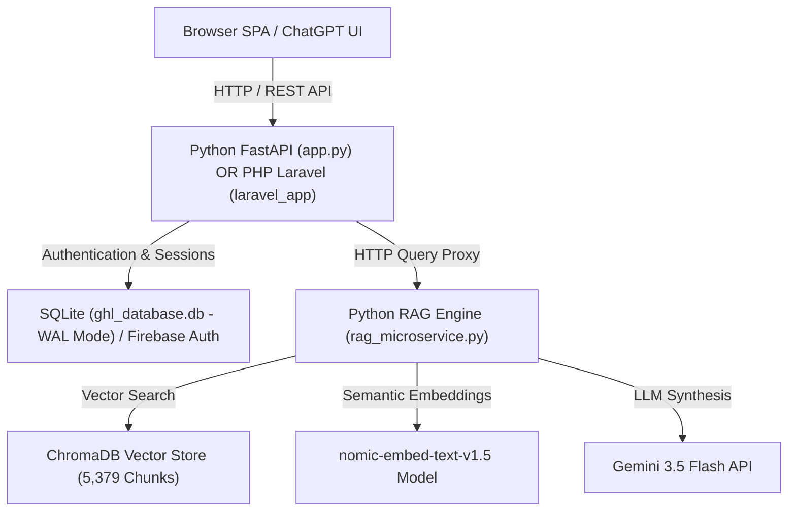

# ⚡ GoHighLevel (GHL) RAG Assistant - ChatGPT AI Platform


An enterprise-grade, production-ready **GoHighLevel (GHL) Technical Support & RAG AI Assistant** built with a **1:1 ChatGPT Dark Experience**, multi-user authentication, persistent conversation history, strict domain guardrails, executive Markdown responses, and a hybrid **PHP Laravel + Python Microservice Architecture**.

---

## 🌟 Key Features

### 🎨 1:1 ChatGPT User Interface
- **Modern Dark Aesthetics**: Custom CSS glassmorphism dark theme matching ChatGPT pixel-for-pixel.
- **Sleek Chat Bubbles**: Right-aligned dark user bubbles (`#2f2f2f`) without floating letter avatars, left-aligned assistant responses with green ⚡ avatar.
- **ChatGPT Sidebar**: Grouped date history (*Today*, *Yesterday*, *Previous 7 Days*, *Older*) with auto-titling, rename, delete, and pin features.
- **Minimalist Top Header**: Clean, distraction-free navbar featuring a single unified sidebar toggle icon.

### 🧠 Advanced RAG Engine (5,379 Chunks)
- **Local Vector Search**: Powered by `chromadb` persistent vector database storing 5,379 official GoHighLevel documentation chunks.
- **High-Precision Embeddings**: Utilizes `nomic-ai/nomic-embed-text-v1.5` sentence-transformer model for semantic search in milliseconds.
- **Gemini 3.5 Flash Synthesis**: Synthesizes accurate technical answers using Google's `gemini-3.5-flash` model.
- **Expandable RAG Context Accordion**: Displays retrieved chunk cards with left green accent borders and a one-click SVG **Copy** button.

### 🛡️ Strict Domain Guardrails & Executive Responses
- **GHL Technical Filtering**: Evaluates user queries to ensure they pertain to GoHighLevel processes, workflows, funnels, webhooks, or APIs.
- **Out-of-Scope Notice**: Automatically rejects off-topic queries (e.g. general knowledge, cooking recipes, gaming) with an executive notice.
- **Executive Response Banners**: Every valid answer starts with a status badge:
  - `🟢 Native GoHighLevel Feature` (Out-of-the-box support).
  - `🟡 Workaround / Third-Party Integration Required` (Zapier, Make, custom Webhooks).
  - `ℹ️ GoHighLevel Technical Overview` (General guidance).

### 🔒 Enterprise Auth, Database & Data Persistence
- **PBKDF2 Password Hashing**: Hashing via `PBKDF2_HMAC_SHA256` with 100,000 iterations and random 32-byte salt.
- **SQLite WAL Mode Data Security**: SQLite database configured with `PRAGMA journal_mode=WAL;` and `PRAGMA synchronous=NORMAL;` guaranteeing 100% data retention across server restarts and updates.
- **Full Firebase Suite**: Optional Firebase Web SDK v10 integration supporting Email/Password, **Google Sign-In**, Cloud Firestore, and Python `firebase-admin` SDK.
- **PHP Laravel Codebase Integration**: Complete Laravel 11.x project architecture (`laravel_app/`) proxying requests to the Python RAG microservice.

---

## 🏗️ System Architecture



---

## 📁 Repository Structure

```text
XortLogix-Chatbot/
├── app.py                  # Main Python FastAPI Application Server (Port 7860)
├── db.py                   # SQLite Database Manager (WAL Mode & User Auth)
├── rag_microservice.py     # Python RAG Engine Microservice for Laravel (Port 7861)
├── firebase_service.py     # Backend Firebase Admin SDK Module
├── requirements.txt        # Python Dependencies
├── .env.example            # Environment Variable Template
├── static/                 # 1:1 ChatGPT Frontend SPA
│   ├── index.html          # Clean HTML5 SPA Markup
│   ├── style.css           # Modern Dark Glassmorphism CSS Design System
│   ├── app.js              # Vanilla JS Frontend Logic & DOM Renderer
│   └── firebase-config.js  # Firebase v10 Modular Web SDK Setup
├── laravel_app/            # PHP Laravel Backend Codebase (Laravel 11.x)
│   ├── app/Controllers/    # AuthController.php & ChatController.php
│   ├── app/Models/         # User.php, Conversation.php, Message.php
│   ├── database/migrations # Database Migration Files
│   └── routes/api.php      # Laravel REST API Routes
└── ghl_chroma_db/          # Persistent ChromaDB Vector Store (5,379 Chunks)
```

---

## 🚀 Quick Start Guide

### 1. Clone the Repository
```bash
git clone https://github.com/muhammadokashapak/XortLogix-Chatbot.git
cd XortLogix-Chatbot
```

### 2. Environment Setup
Create a `.env` file in the root directory (refer to `.env.example`):
```ini
GEMINI_API_KEY=your_gemini_api_key_here
PORT=7860
HOST=127.0.0.1
```

### 3. Install Python Dependencies
```bash
pip install -r requirements.txt
```

### 4. Run Main Application
```bash
python app.py
```
Open **[http://127.0.0.1:7860](http://127.0.0.1:7860)** in your browser!

---

## 🐘 Running with PHP Laravel Backend

If you prefer to run the application using the **PHP Laravel** backend:

1. **Start the Python RAG Microservice**:
   ```bash
   python rag_microservice.py
   ```
2. **Migrate & Run Laravel**:
   ```bash
   cd laravel_app
   php artisan migrate
   php artisan serve --port=8000
   ```

---

## 📡 API Reference

### Authentication Endpoints
- `POST /api/auth/signup`: Create a new user account.
- `POST /api/auth/login`: Authenticate and set HTTP-Only session cookie.
- `GET /api/auth/me`: Get current authenticated user profile.
- `POST /api/auth/logout`: Revoke session.

### Conversation & Chat Endpoints
- `GET /api/conversations`: List user conversation history (sorted by date).
- `GET /api/conversations/{id}`: Get full message thread for a conversation.
- `POST /api/conversations/{id}/pin`: Toggle pinned state of a conversation.
- `DELETE /api/conversations/{id}`: Delete a conversation.
- `POST /api/chat`: Send prompt to RAG pipeline (returns answer, retrieved sources, execution time, and conversation metadata).

---

## 🤝 Contributing

Contributions are welcome! Please feel free to submit a Pull Request or open an Issue on GitHub.

---

## 📄 License

Distributed under the MIT License. See `LICENSE` for more information.

Developed by **[Muhammad Okasha](https://github.com/muhammadokashapak)** for **XortLogix**.